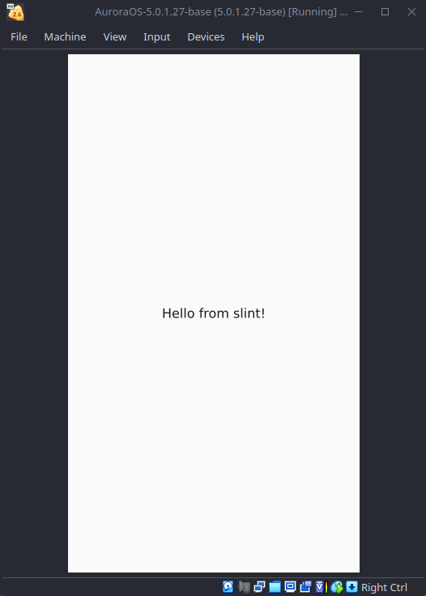

# Slint Aurora OS (Sailfish OS) example

Простое приложение, написанное с использованием фреймворка [slint](https://slint.dev).

  
Сриншот работы приложения на устройстве

    
  

## Подготовка к сборке

* Установить [Aurora PSDK](https://developer.auroraos.ru/doc/sdk/psdk)
